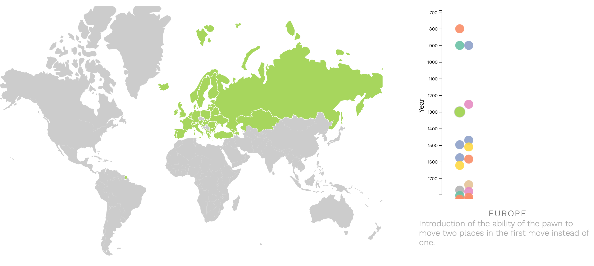
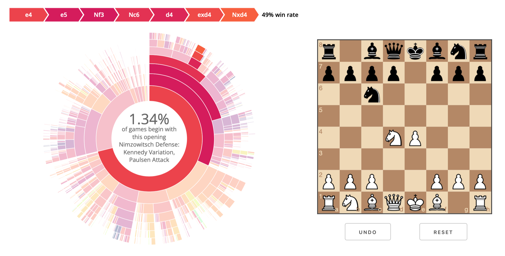
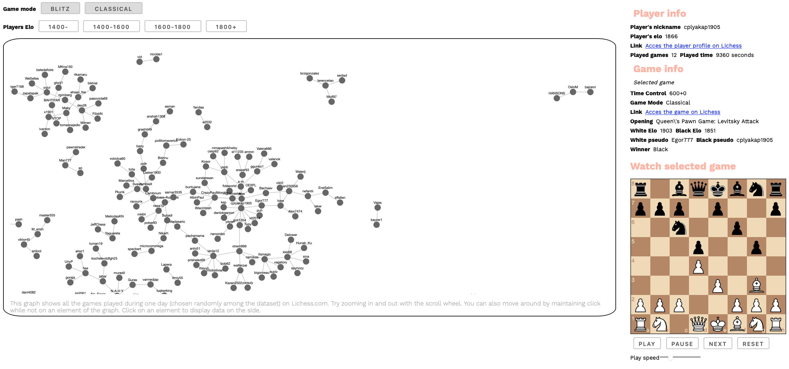
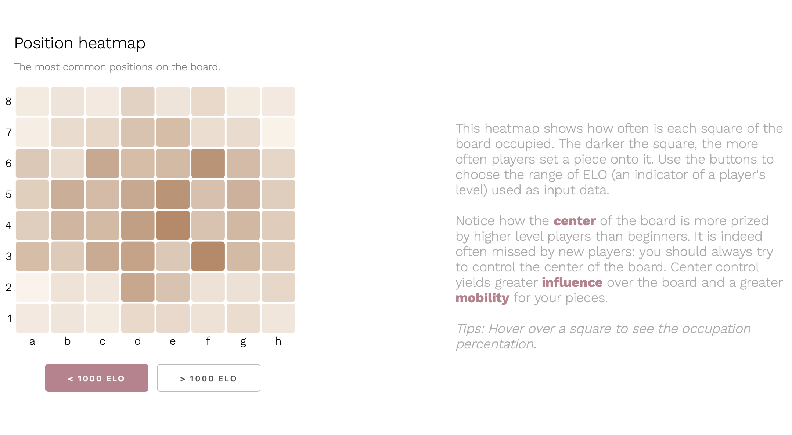

# Chess Analysis

This project has been realized in the context of EPFL COM-480 Data Visualization course. We use logs from a million chess games to draw insights and convey them intuitively through visualizations. The gist of the project is the visualizations implementation, using D3.js.  

We implement a whole data analysis pipeline from preprocessing and data mining in Python and pandas to data visualization using HTML, CSS, JS for the website and D3.js for the actual visulizations. The [report](reports/process_book.pdf) describes our approach, our goals and give more detailed explanations of each visualization.

My contributions are significant to this project:
* The data parsing, available in [this notebook](./notebooks/parse_raw_data.ipynb), shaping a single dump of logs into tabular data
* The website architecture: the landing page, the animations, the navigations, etc, in [this folder](./docs).
* The [timeline visualization](https://com-480-data-visualization.github.io/data-visualization-project-2021-rookies/viz/timeline/timeline.html)
* The [board control visualization](https://com-480-data-visualization.github.io/data-visualization-project-2021-rookies/viz/heatmap/heatmap.html)
* The [openings visualization](https://com-480-data-visualization.github.io/data-visualization-project-2021-rookies/viz/sunburst/sunburst.html)

The sole purpose of this fork is to list the project within my personal Github page and list my contributions. These lines are the only modifications to the original repository.

<p align="center">
     <a href="https://www.youtube.com/watch?v=fz3awj4zVCc">Check out the screencast</a>
</p>

<p align="center">
     <a href="https://com-480-data-visualization.github.io/data-visualization-project-2021-rookies/">Go to website - developped for Firefox </a>
</p>


Some images of the website:


  |  
:-------------------------:|:-------------------------:
  |  

## Introduction

The dataset used throughout the project is a collection of chess games that occurred on the online chess platform called Lichess. Accounting around one million games, we took advantage of the dataset size to draw some tips and conclusions with a data-driven approach. We set our main objective towards providing an overview of the main aspects and strategies of chess for each player level. In other words, we aspire to give a general and visual understanding of the game that is tailored to users' familiarity with chess. For instance, beginners are more interested in basic tactics and common moves, intermediates with the most useful openings and advanced players with some examples of games from the best players in the dataset. The visualizations allow each player to explore and get insights from thousands of games, letting them take a new look at chess, use it as a tool to improve their future strategies or spark a new interest for the game.

## Reports

You can find the process book as well as the different milestones below.

[Process book](reports/process_book.pdf) • [Milestone 1](reports/Milestone1.md) • [Milestone 2](reports/Milestone2.md)

## Project architecture

```       
├───img                 Images used in milestones
├───reports             Milestones and process book
├───notebooks           Notebooks used for preprocessing
├───assets              Images used in the website
└───docs                Website top folder
     ├───libraries      Libraries used in the project       
     ├───viz            Folder containing the 5 visualizations
     ├───styles.css     Root stylesheet
     └───index.html     Website homepage

```

## Setup

The website has been created to be standalone, such that there is no need
to install any libraries beforehand. To start contributing, clone the repository
and start a server from `index.html`.


